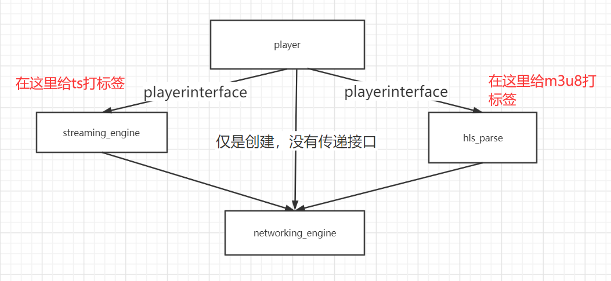
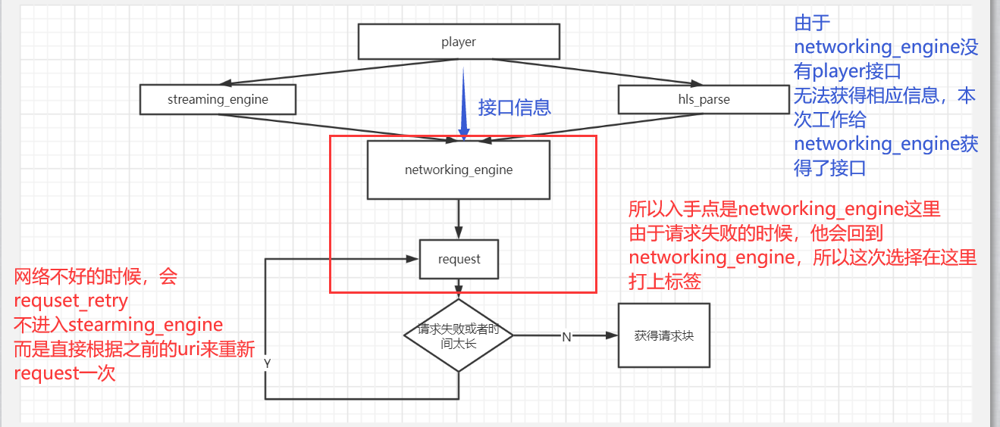
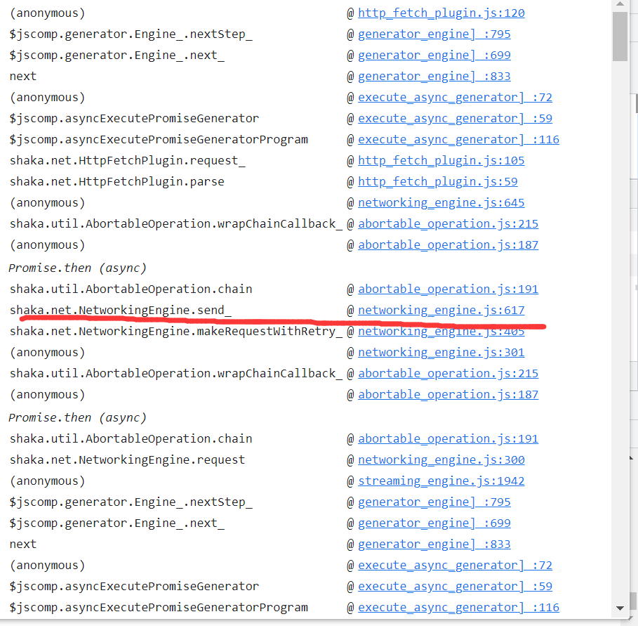

# branch V2

## 21.10.30 First commit

### 打标签处理方式

出现问题的原因以及修改方式：

函数调用栈以及打标签位置：

### 打标签含义

##### 流标志flow_key

一个0-1000的整数用来标识流

##### 下载速率rate

由abr算法直接获得，单位bps

##### 播放类型player_type

我们设置

| 播放窗口大小（默认16比9） | 类别 |
| :-----------------------: | :--: |
|        height>1440        | 电视 |
|     1080<height<1440      | 电脑 |
|        height<1080        | 手机 |

并用播放窗口大小来区别不同设备：

| 视频类型 |       设备       | 标记 |
| :------: | :--------------: | :--: |
|    ×     | 分辨率不满足要求 |  0   |
|  动作片  |       电视       |  1   |
|  动作片  |       电脑       |  2   |
|  动作片  |       手机       |  3   |
|   美食   |       电视       |  4   |
|   美食   |       电脑       |  5   |
|   美食   |       手机       |  6   |
|   动画   |       电视       |  7   |
|   动画   |       电脑       |  8   |
|   动画   |       手机       |  9   |
|   运动   |       电视       |  10  |
|   运动   |       电脑       |  11  |
|   运动   |       手机       |  12  |
