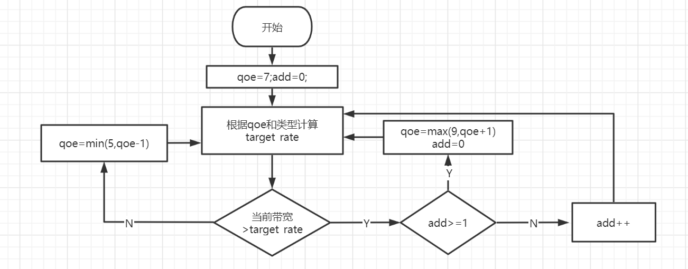

# 提交记录及其说明

## 21.10.6第二次提交

增加了紧急阈值（5s）

即缓存区小于5s，下一个块就是紧急的

使用?mode=x添加到http请求后来表示

mode=1紧急，mode=2非紧急

## 21.10.19第三次提交

说明：

1. 紧急阈值（5s）

   即缓存区小于5s，下一个ts视频块就是紧急

   表1

   | 紧急状态 | 标志 |
   | :------: | :--: |
   |   紧急   |  1   |
   |   正常   |  2   |

2. qoe逻辑（每次新的getsegmentref时候计算target_rate）

   图1

   

3. 目标码率（target_rate）

   根据播放类型（视频类型、设备）得到。详见表3

4. 播放类型player_type

   我们设置

   表2

   | 播放窗口大小（默认16比9） | 类别 |
   | :-----------------------: | :--: |
   |        height>1440        | 电视 |
   |     1080<height<1440      | 电脑 |
   |        height<1080        | 手机 |

   并用播放窗口大小来区别不同设备：

   表3

   | 视频类型 |       设备       | 标记 |  target_rate表达式（自变量x=qoe）  |
   | :------: | :--------------: | :--: | :--------------------------------: |
   |    ×     | 分辨率不满足要求 |  0   |                 ×                  |
   |  动作片  |       电视       |  1   |  exp((2000*x)/4891 + 88652/24455)  |
   |  动作片  |       电脑       |  2   | exp((10000*x)/16611 + 16049/5537)  |
   |  动作片  |       手机       |  3   | exp((10000*x)/16927 + 45966/16927) |
   |   美食   |       电视       |  4   | exp((5000*x)/12161 + 40761/12161)  |
   |   美食   |       电脑       |  5   |  exp((2000*x)/3487 + 51723/17435)  |
   |   美食   |       手机       |  6   | exp((10000*x)/20071 + 58200/20071) |
   |   动画   |       电视       |  7   | exp((10000*x)/18509 + 48633/18509) |
   |   动画   |       电脑       |  8   | exp((10000*x)/18749 + 61618/18749) |
   |   动画   |       手机       |  9   | exp((10000*x)/17551 + 50058/17551) |
   |   运动   |       电视       |  10  |  exp((2500*x)/5219 + 77861/20876)  |
   |   运动   |       电脑       |  11  |  exp((5000*x)/8309 + 29776/8309)   |
   |   运动   |       手机       |  12  |  exp((5000*x)/8271 + 26461/8271)   |

## 21.10.20第四次提交

flowid是一个0到1000的随机数

添加了flowid并且为m3u8文件添加上了uri信息。

## 21.10.27第五次提交

本次提交没有删除（后面可能需要）前面工作的代码（没有使用到之前的代码）。

之前打标签方式：

出现问题的原因以及修改方式：

函数调用栈以及打标签位置：

此外，更新了qoe变化逻辑：

使得qoe变化的更保守，带宽减少时，赶紧把qoe减小，使得target_rate下降

而target_rate增加，则需要经过两个周期。

