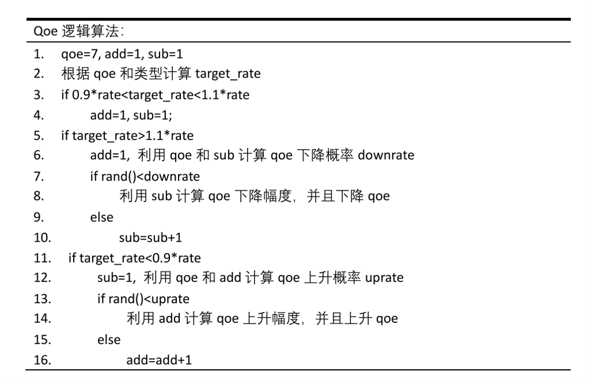
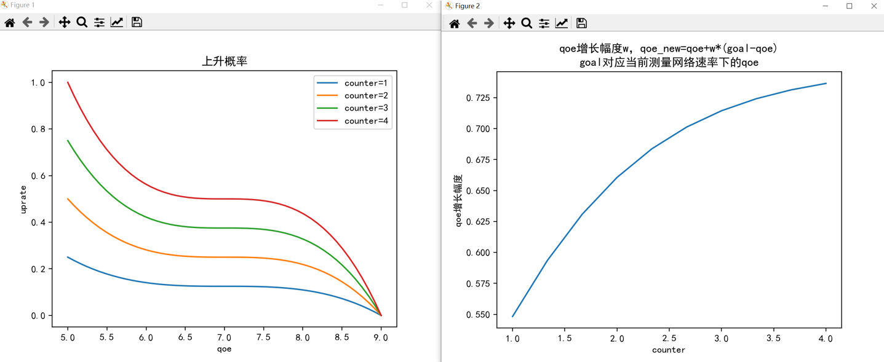

# 提交说明

## 22.1.13

说明：

1. flow_id

   一个0到1000的随机数

1. 紧急阈值（5s）

   即缓存区小于5s，下一个ts视频块就是紧急

   表1

   | 紧急状态 | 标志 |
   | :------: | :--: |
   |   紧急   |  1   |
   |   正常   |  2   |

3. qoe逻辑

   流程图，初始qoe=7, 计数器add=1, sub=1，rand()为计算机产生0到1随机浮点数

   

4. qoe上升概率，上升幅度计算，以上升为例，下降也是一样的

   采取函数:

   **（左）上升/下降概率函数rate采用的是三次函数(cubic也是三次函数)**

   这边counter就是上文算法中的add和sub计数器，考虑到ts块长度较大，一般为5s，所以在counter=4，一般就认为要急切的上升了（体现在counter=4，qoe=5时，如果测到rate大于target，qoe会快速上升）

   **（右）上升/下降增长幅度函数w采取的是机器学习常用的sigmoid（softmax）**

   右边函数和counter有关，counter越大，增长幅度越大

   当counter=4时，qoe的增长幅度是0.75,即qoe_new=(goal-qoe)*0.75+qoe

   goal计算请见表三

   

4. 播放类型player_type

   我们设置

   表2

   | 播放窗口大小（默认16比9） | 类别 |
   | :-----------------------: | :--: |
   |        height>1440        | 电视 |
   |     1080<height<1440      | 电脑 |
   |        height<1080        | 手机 |

   并用播放窗口大小来区别不同设备：

   表3

   | 视频类型 |       设备       | 标记 |     goal表达式（自变量x=qoe）      |
   | :------: | :--------------: | :--: | :--------------------------------: |
   |    ×     | 分辨率不满足要求 |  0   |                 ×                  |
   |  动作片  |       电视       |  1   |  exp((2000*x)/4891 + 88652/24455)  |
   |  动作片  |       电脑       |  2   | exp((10000*x)/16611 + 16049/5537)  |
   |  动作片  |       手机       |  3   | exp((10000*x)/16927 + 45966/16927) |
   |   美食   |       电视       |  4   | exp((5000*x)/12161 + 40761/12161)  |
   |   美食   |       电脑       |  5   |  exp((2000*x)/3487 + 51723/17435)  |
   |   美食   |       手机       |  6   | exp((10000*x)/20071 + 58200/20071) |
   |   动画   |       电视       |  7   | exp((10000*x)/18509 + 48633/18509) |
   |   动画   |       电脑       |  8   | exp((10000*x)/18749 + 61618/18749) |
   |   动画   |       手机       |  9   | exp((10000*x)/17551 + 50058/17551) |
   |   运动   |       电视       |  10  |  exp((2500*x)/5219 + 77861/20876)  |
   |   运动   |       电脑       |  11  |  exp((5000*x)/8309 + 29776/8309)   |
   |   运动   |       手机       |  12  |  exp((5000*x)/8271 + 26461/8271)   |

## 打标签实现架构图

之前打标签方式：

出现问题的原因以及修改方式：

函数调用栈以及打标签位置：

